# Install Cloudera Manager 7.11.3 & CDP Runtime 7.1.9 (Full Guide)

End-to-end steps to install **Cloudera Manager 7.11.3** and set up a **CDP Runtime 7.1.9** cluster.  
Semua perintah dijalankan sebagai **root**. Placeholder seperti `(username)` dan `(password)` harus kamu ganti.

---

## 1) Configure Repository & Install CM Server/Agent

### 1.1 Download Cloudera Manager repo (via `wget`)
```bash
# Ganti (username) dan (password) dengan kredensial Cloudera Archive kamu
wget --user="(username)" --password="(password)"   "https://archive.cloudera.com/p/cm7/7.11.3.0/redhat8/yum/cloudera-manager.repo"   -O /etc/yum.repos.d/cloudera-manager.repo
```

> Alternatif dengan `curl`:
```bash
curl -u "(username):(password)"   -o /etc/yum.repos.d/cloudera-manager.repo   "https://archive.cloudera.com/p/cm7/7.11.3.0/redhat8/yum/cloudera-manager.repo"
```

### 1.2 Import GPG key repo
```bash
rpm --import https://archive.cloudera.com/p/cm7/7.11.3.0/redhat8/yum/RPM-GPG-KEY-cloudera
```

### 1.3 (Opsional) Verifikasi dan refresh cache
```bash
cat /etc/yum.repos.d/cloudera-manager.repo
dnf clean all && dnf makecache
```

### 1.4 Install paket CM server/agent/daemons
```bash
dnf install -y cloudera-manager-daemons cloudera-manager-agent cloudera-manager-server
```

### 1.5 (Jika perlu) Edit repo manual
Jika kamu tidak menggunakan `wget --user --password`, pastikan field berikut ada di repo file dan isi nilai:
```ini
username=(username)
password=(password)
```

### 1.6 Setup Database untuk Cloudera Manager
Cek file properti DB:
```bash
cat /etc/cloudera-scm-server/db.properties
```
Pastikan mengarah ke DB **scm** di PostgreSQL/MySQL/Oracle sesuai pilihanmu.

### 1.7 Start & enable services
```bash
systemctl enable --now cloudera-scm-server
systemctl enable --now cloudera-scm-agent

systemctl status cloudera-scm-server
systemctl status cloudera-scm-agent
```

### 1.8 Akses Web UI
```
http://<hostname>:7180
```

---

## 2) Cloudera Manager Web UI Wizard (Step-by-step)

### 2.1 Upload License
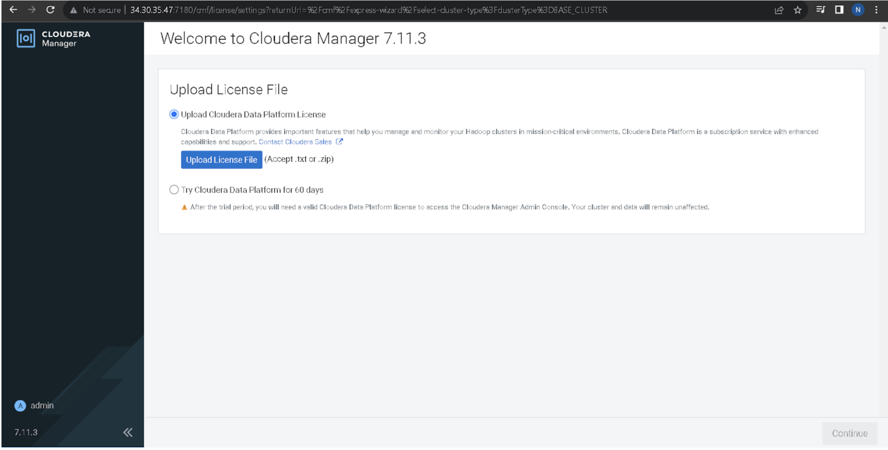
- Upload file lisensi atau pilih trial 60 hari.

### 2.2 Cluster Basics
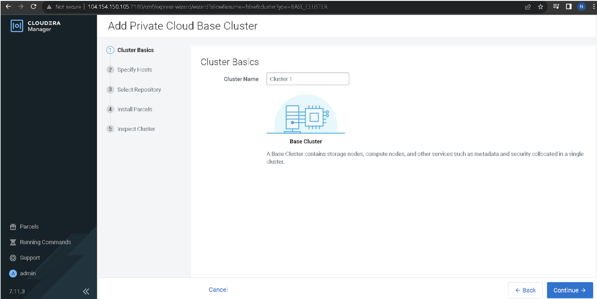
- Isi **Cluster Name** (misal: `Cluster 1`).

### 2.3 Specify Hosts
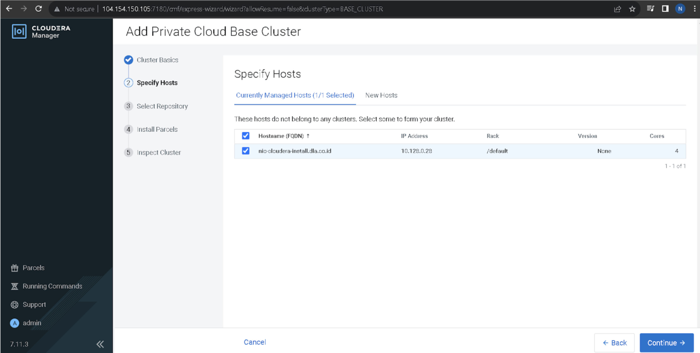
- Masukkan FQDN host (pastikan `hostname -f` konsisten).

### 2.4 Parcel Repository & Network Settings

- Pastikan URL repository **CDP Runtime 7.1.9** valid.
- Tambahkan Intel MKL (opsional): `https://parcels.repos.intel.com/mkl/latest`.

### 2.5 Select Repository
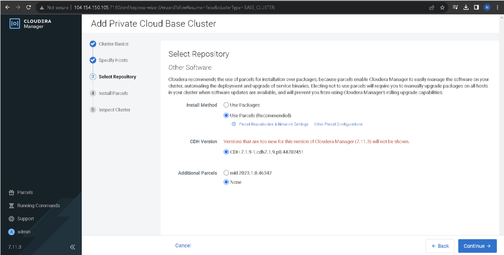
- Pilih **Cloudera Runtime 7.1.9** dan parcel tambahan bila perlu.

### 2.6 Install Parcels
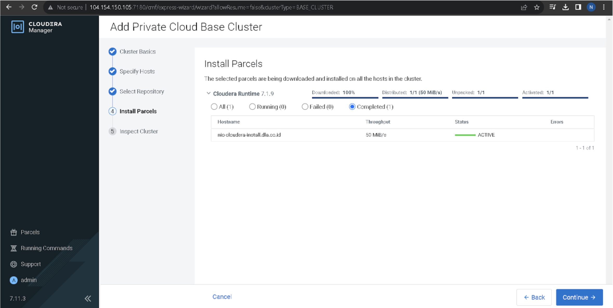
- Jika agent error, jalankan: `systemctl restart cloudera-scm-agent`.

### 2.7 Inspect Cluster
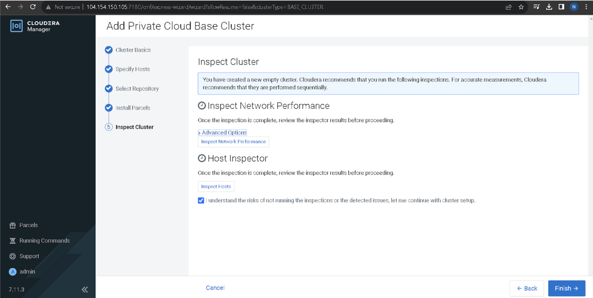
- Jalankan **Network Inspector** & **Host Inspector**.

---

## 3) Add Services & Configure (Wizard Lanjutan)

### 3.1 Select Services
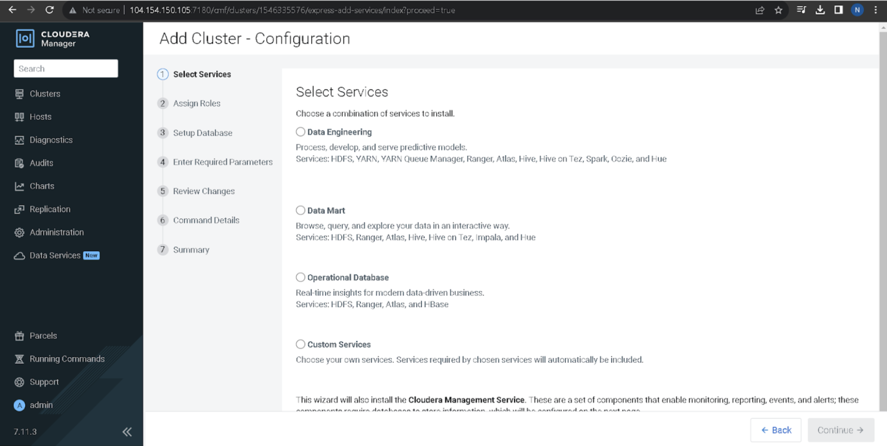
Contoh pilihan (custom):
- HDFS, Hive, Hive on Tez, Spark 3, YARN, YARN Queue Manager, Tez, ZooKeeper, Atlas.

### 3.2 Assign Roles
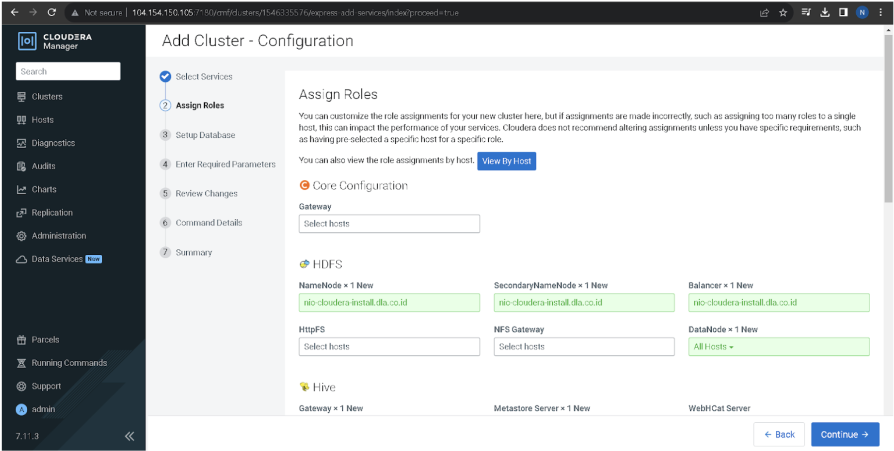
Contoh single-node:
- HDFS: NameNode, SecondaryNameNode, DataNode, Balancer → `(hostname)`
- Hive: Metastore, WebHCat, Gateway → `(hostname)`
- YARN: ResourceManager, NodeManager, JobHistory → `(hostname)`
- ZooKeeper Server → `(hostname)`

### 3.3 Setup Databases (Hive/YARN/Reports, dll.)
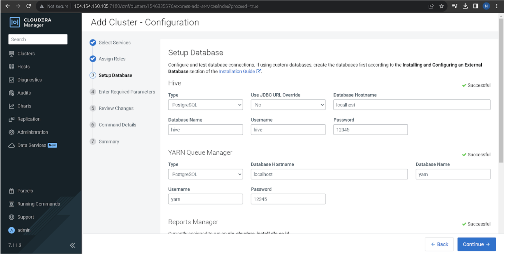
Gunakan DB eksternal (PostgreSQL dari langkah sebelumnya):
- Hive → db:`hive`, user:`hive`, pass:`(password)`
- YARN → db:`yarn`, user:`yarn`, pass:`(password)`
- Reports Manager → db:`rman`, user:`rman`, pass:`(password)`  
Klik **Test Connection** sampai **Successful**.

### 3.4 Enter Required Parameters
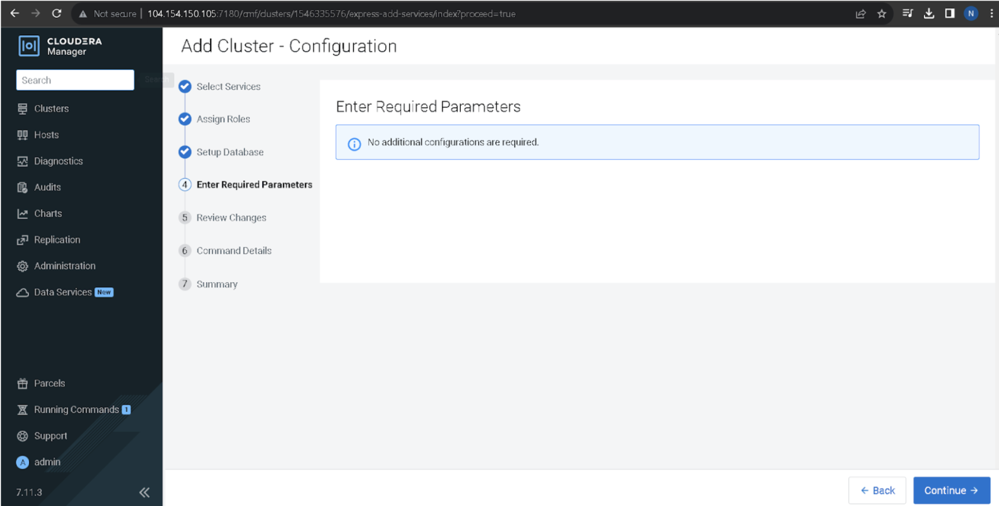
- Biarkan default kecuali ada kebutuhan khusus.

### 3.5 Review Changes
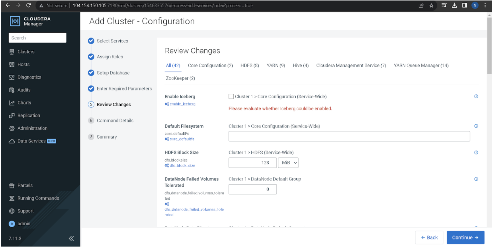
- Default FS: `HDFS`
- Block size: `128 MB`
- Iceberg: sesuai kebutuhan.

### 3.6 Command Details
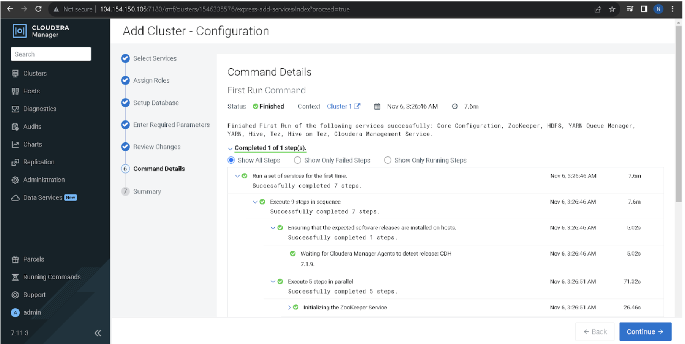
- Wizard akan inisialisasi ZooKeeper, format HDFS, start Hive & YARN, dll.

### 3.7 Finish → Dashboard
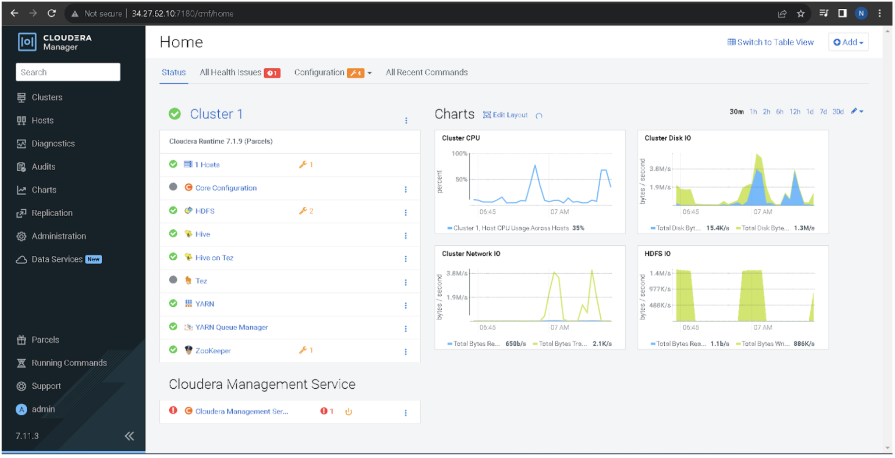
- Pastikan semua service **green**.

---

## 4) Troubleshooting Notes

### 4.1 Agent tidak mengenali OS (Parcel Install)
Backup, spoof RHEL 8.8, restart agent, lalu **restore** setelah selesai.
```bash
# Backup
cp /usr/lib/os-release /usr/lib/os-release.back
cp /etc/os-release /etc/os-release.back

# Spoof (isi seperti RHEL 8.8), atau gunakan contoh isi di catatanmu
vi /usr/lib/os-release
vi /etc/os-release

# Restart agent
systemctl restart cloudera-scm-agent

# Setelah parcels selesai → restore
mv /usr/lib/os-release.back /usr/lib/os-release
mv /etc/os-release.back /etc/os-release
systemctl restart cloudera-scm-agent
```

### 4.2 Cek log server/agent
```bash
tail -f /var/log/cloudera-scm-server/cloudera-scm-server.log
tail -f /var/log/cloudera-scm-agent/cloudera-scm-agent.log
```

---

## 5) Hasil Akhir
- CM UI (`:7180`) up & running
- Parcels CDP 7.1.9 ter-install & activated
- Services (HDFS, Hive, YARN, ZooKeeper, dll.) berjalan

---
