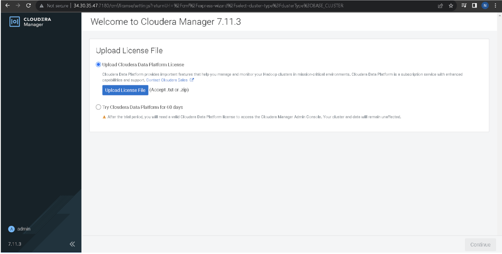
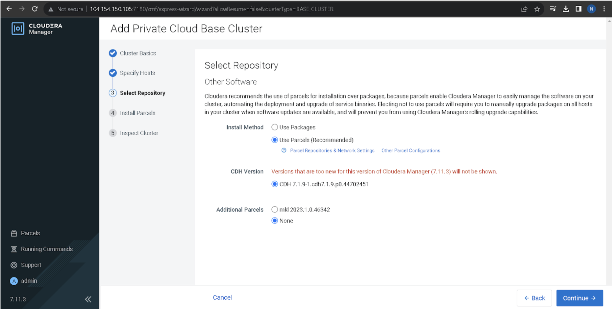
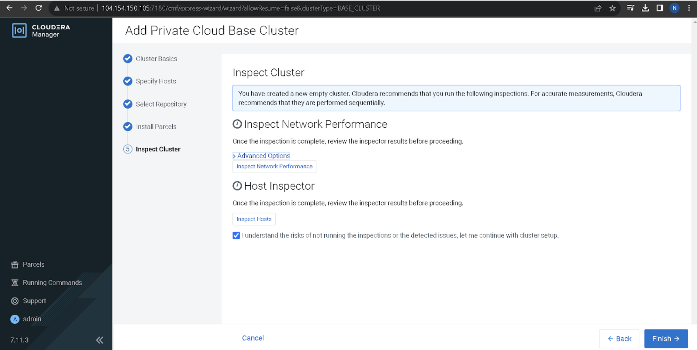
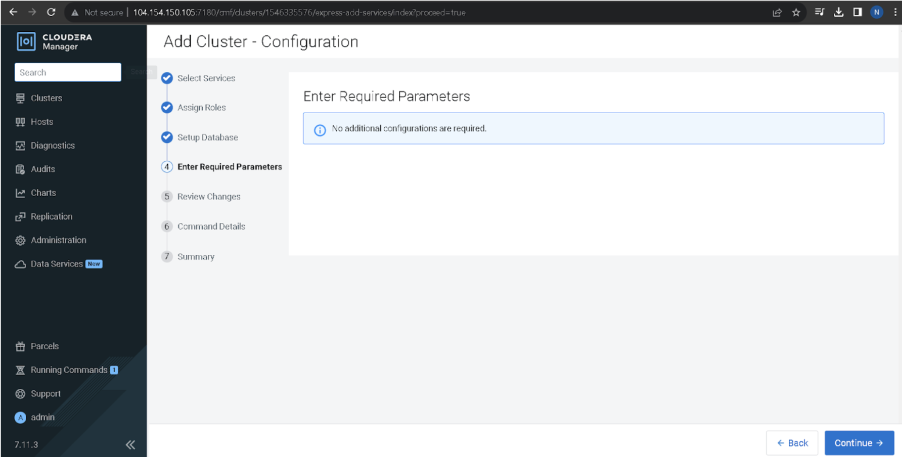

# Install Cloudera Manager 7.11.3 & CDP Runtime 7.1.9

This guide covers the **end-to-end installation** of Cloudera Manager (CM) and CDP Runtime, including OS preparation, installing CM server/agent, and completing the setup via the Cloudera Manager Web UI wizard.

---

## 1. Install Cloudera Manager Server & Agent

### 1.1 Install Required Packages
```bash
sudo dnf install cloudera-manager-daemons cloudera-manager-agent cloudera-manager-server
```

### 1.2 Configure Repository
Edit file:
```bash
sudo vi /etc/yum.repos.d/cloudera-manager.repo
```

Example content (replace `(username)` / `(password)` with your Cloudera archive credentials):
```ini
[cloudera-manager]
name=Cloudera Manager 7.11.3.0
baseurl=https://archive.cloudera.com/p/cm7/7.11.3.0/redhat7/yum/
gpgkey=https://archive.cloudera.com/p/cm7/7.11.3.0/redhat7/yum/RPM-GPG-KEY-cloudera
username=(username)
password=(password)
gpgcheck=1
enabled=1
autorefresh=0
type=rpm-md

[postgresql10]
name=Postgresql 10
baseurl=https://archive.cloudera.com/postgresql10/redhat7/
gpgkey=https://archive.cloudera.com/postgresql10/redhat7/RPM-GPG-KEY-PGDG-10
enabled=1
gpgcheck=1
module_hotfixes=true
```

### 1.3 Setup Database for CM
Check database properties file:
```bash
cat /etc/cloudera-scm-server/db.properties
```

Ensure DB is configured for `scm` user (PostgreSQL/MySQL/Oracle depending on your environment).

### 1.4 Start Services
```bash
systemctl enable --now cloudera-scm-server
systemctl enable --now cloudera-scm-agent
```

Check status:
```bash
systemctl status cloudera-scm-server
systemctl status cloudera-scm-agent
```

### 1.5 Access Cloudera Manager UI
Open browser:
```
http://<server-host>:7180
```

---

## 2. Cloudera Manager Web UI Wizard

Once services are running, open the web wizard to configure the cluster.

### 2.1 Upload License File


You can either:
- Upload valid Cloudera license file (`.txt` or `.zip`)
- Use 60-day trial

### 2.2 Add Private Cloud Base Cluster


- Define cluster name (e.g., `Cluster 1`)

### 2.3 Specify Hosts


- Add all hostnames (FQDN)  
- Verify IPs and OS detection

### 2.4 Parcel Repository & Network Settings


Ensure correct repository URLs:
- Cloudera Runtime 7.1.9
- Intel MKL (optional)

### 2.5 Select Repository


Choose parcels to install:
- **Cloudera Runtime 7.1.9**
- Optional: additional parcels (e.g., Oozie, Spark3)

### 2.6 Install Parcels


If issues occur:
```bash
systemctl restart cloudera-scm-agent
```

### 2.7 Inspect Cluster


- Run **Network Inspector**
- Run **Host Inspector**

---

## 3. Add Services (Wizard Part 2)

### 3.1 Select Services


Options:
- Data Engineering
- Data Mart
- Operational Database
- Custom Services

Example custom services:
- HDFS, Hive, Tez, YARN, ZooKeeper, Spark3, SMM

### 3.2 Assign Roles


- Assign NameNode, SecondaryNameNode, DataNode
- Assign Hive Metastore, WebHCat, HiveServer2
- Assign YARN ResourceManager, NodeManager

### 3.3 Setup Databases


Configure external DBs for services (PostgreSQL recommended):
- Hive → db: `hive` user `(password)`
- YARN → db: `yarn` user `(password)`
- Reports Manager → db: `rman` user `(password)`

Test each connection before continuing.

### 3.4 Enter Required Parameters


Apply defaults unless custom tuning is needed.

### 3.5 Review Changes


Check:
- Enable Iceberg (optional)
- Default FS: HDFS
- HDFS Block Size: `128 MB`

### 3.6 Command Details


The wizard will:
- Deploy core configs
- Initialize ZooKeeper
- Start HDFS, Hive, YARN

### 3.7 Finish Setup


Cluster is now running and visible in Cloudera Manager dashboard.

---

## 4. Post-Installation Notes

- Check logs if services fail:
```bash
tail -f /var/log/cloudera-scm-server/cloudera-scm-server.log
tail -f /var/log/cloudera-scm-agent/cloudera-scm-agent.log
```

- To fix host OS mismatch during parcel install:
```bash
cp /usr/lib/os-release /usr/lib/os-release.back
cp /etc/os-release /etc/os-release.back
# Inject temporary RHEL version
vi /usr/lib/os-release
vi /etc/os-release
systemctl restart cloudera-scm-agent
# Restore after installation
mv /usr/lib/os-release.back /usr/lib/os-release
mv /etc/os-release.back /etc/os-release
systemctl restart cloudera-scm-agent
```

---

## 5. Result

At the end of the wizard:
- CM UI shows active cluster
- Services (HDFS, Hive, YARN, ZooKeeper) are running
- Dashboard provides metrics (CPU, Disk IO, Network IO, HDFS IO)

---
