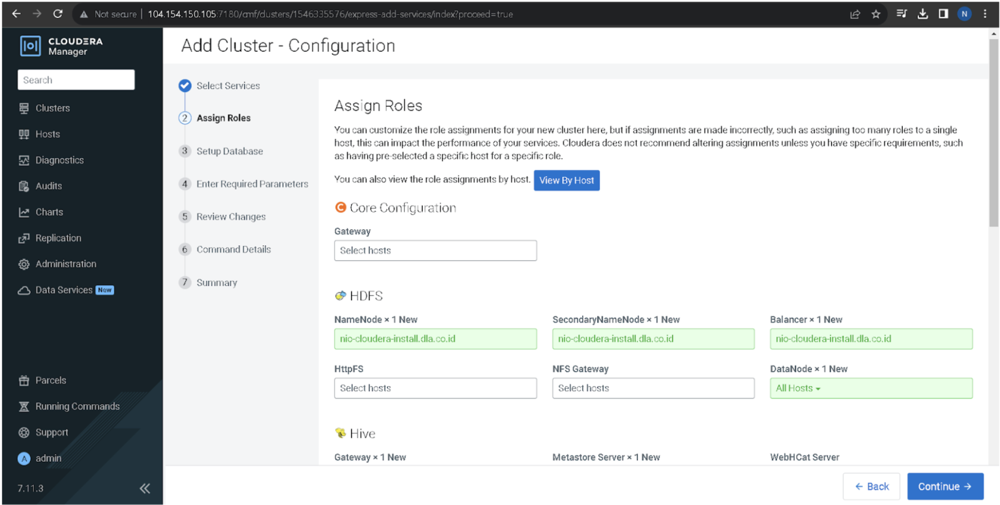
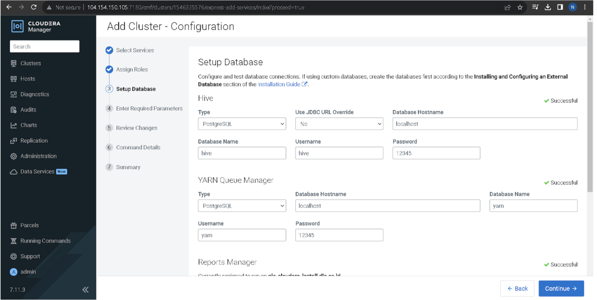

# Cloudera Manager Cluster Setup (Part 2)

After installing **Cloudera Manager 7.11.3**, proceed with cluster setup and service configuration.  
This section covers **Add Cluster Wizard** steps: selecting services, assigning roles, configuring databases, and finalizing the installation.

---

## 1. Select Services

Choose a combination of services to install. Options include:

- **Data Engineering** (HDFS, YARN, Hive, Spark, Oozie, etc.)
- **Data Mart** (HDFS, Hive, Impala, Hue, Atlas, etc.)
- **Operational Database**
- **Custom Services** (recommended for tailored installs)

Example (custom selection):
- Atlas  
- HDFS  
- Hive + Hive on Tez  
- Spark 3  
- YARN + YARN Queue Manager  
- Tez  
- ZooKeeper  

```text
[✔] HDFS
[✔] Hive
[✔] Hive on Tez
[✔] Spark 3
[✔] YARN
[✔] YARN Queue Manager
[✔] Tez
[✔] ZooKeeper
[✔] Atlas
```

---

## 2. Assign Roles

Assign roles to cluster hosts.  
Example single-node setup:

- **Core Configuration**: Gateway → (hostname)  
- **HDFS**: NameNode, SecondaryNameNode, DataNode, Balancer → (hostname)  
- **Hive**: Metastore Server, WebHCat Server, Gateway → (hostname)  
- **YARN**: ResourceManager, NodeManager, JobHistory Server → (hostname)  
- **ZooKeeper**: Server → (hostname)  

```bash
# Example assignment
HDFS NameNode        → nio-cloudera-install.dla.co.id
HDFS DataNode        → nio-cloudera-install.dla.co.id
Hive Metastore       → nio-cloudera-install.dla.co.id
YARN ResourceManager → nio-cloudera-install.dla.co.id
```

---

## 3. Setup Databases

Each service requires a database. Fill in credentials for Hive, YARN, Oozie, etc.  
(Use previously created PostgreSQL users from `Install_PostgreSQL_14.9.md`).

Example configuration:

- **Hive**  
  - Type: PostgreSQL  
  - Host: `localhost`  
  - Database: `hive`  
  - Username: `hive`  
  - Password: `(passwordnya)`  

- **YARN Queue Manager**  
  - Type: PostgreSQL  
  - Host: `localhost`  
  - Database: `yarn`  
  - Username: `yarn`  
  - Password: `(passwordnya)`  

- **Reports Manager**  
  - Type: PostgreSQL/MySQL  
  - Database: `rman`  
  - Username: `rman`  
  - Password: `(passwordnya)`  

Click **Test Connection** → ensure **Successful** status.

---

## 4. Enter Required Parameters

Some services may require additional parameters.  
In most setups, no extra changes are needed. If prompted, fill according to environment.

---

## 5. Review Changes

Review cluster-wide settings before deployment.  
Examples:
- Enable Iceberg: Off (unless needed)  
- Default Filesystem: `hdfs://<hostname>:8020`  
- HDFS Block Size: `128 MB`  
- DataNode Failed Volumes Tolerated: `0`  

---

## 6. Command Details

Cloudera Manager will run initial commands to deploy roles and configure services.  
Monitor progress:  
- ZooKeeper initialized  
- HDFS formatted  
- Hive Metastore initialized  
- YARN ResourceManager started  

Status should show **Finished** with green checks.

---

## 7. Summary & First Login

When setup completes, Cloudera Manager will show the cluster dashboard.

Access the Cloudera Manager UI:  
```
http://(hostname):7180
```

Check that services (HDFS, Hive, YARN, ZooKeeper, etc.) are **running**.  
If any service fails, inspect logs in `/var/log/cloudera-scm-agent` and `/var/log/cloudera-scm-server`.

---

## 📷 Reference Screenshots

Place screenshots under `images/` directory and reference them in the doc:

- 
- 
- 
- 
- 
- 

---
